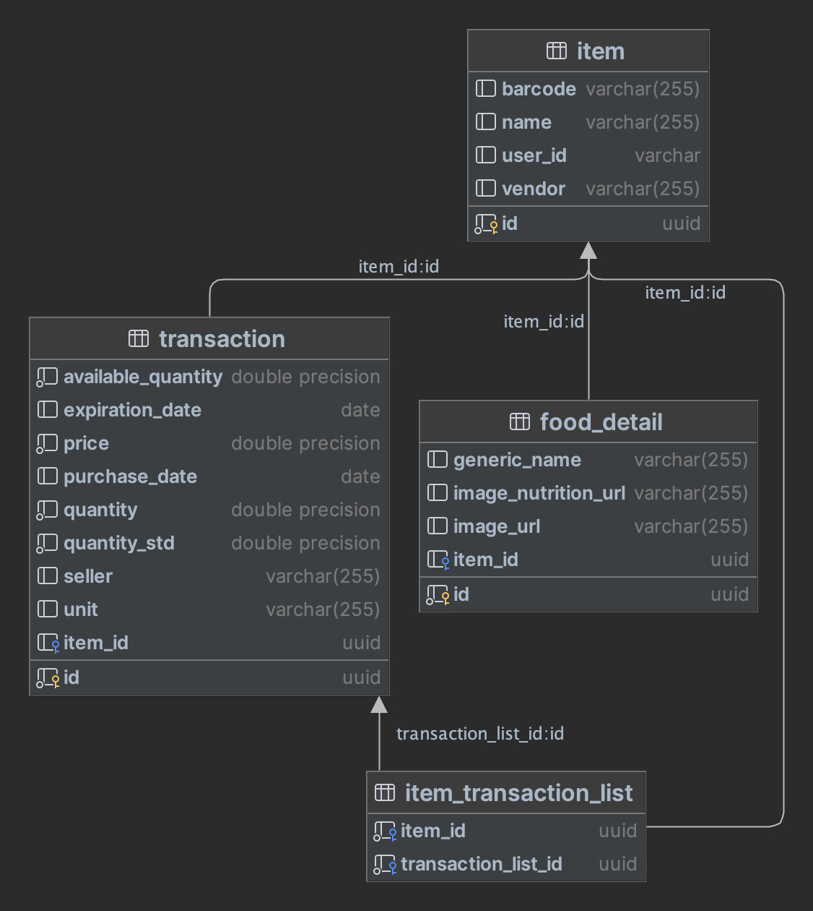

# Grocery-be

[](https://github.com/nico-iaco/grocery-be/actions/workflows/gcp.yml)

## Description

This app is like an inventory for your groceries. You can track your groceries and their expiration dates. You can also add new items to your inventory.
When used with [food-track-be](https://github.com/nico-iaco/food-track-be) you can track your food usage and see how much you have left. 
This app use [food-details-integrator-be](https://github.com/nico-iaco/food-details-integrator-be) to retrive additional information about the food like nutritional details.

## Features

- [x] Manage items in your inventory
- [x] Track expiration dates
- [x] The application is built in native mode with spring native to improve startup time

## Requirements

- [PostgreSQL](https://www.postgresql.org/)
- [food-details-integrator-be](https://github.com/nico-iaco/food-details-integrator-be) (optional)

## Installation

### Cluster installation

To install the application in a cluster you need to have a running PostgreSQL database. Then you have to create grocery
namespace, modify the kustomization.yaml file to match your configuration and run the following command:

```bash
kubectl apply -k k8s/overlays/qa
```

### Local installation

To run the application locally with docker. To do so run the following command:

```bash
docker run -p 8080:8080 ghcr.io/nico-iaco/grocery-be:latest -e {All the environment variables}
```

## Environment variables

| Name                  | Description                              | Default value         |
|-----------------------|------------------------------------------|-----------------------|
| DB_URL                | The host of the database                 |                       |
| DB_USER               | The user of the database                 |                       |
| DB_PASSWORD           | The password of the database             |                       |
| DB_NAME               | The name of the database                 |                       |
| FOOD_DETAILS_BASE_URL | Base url for food-details-integration-be | http://localhost:8081 |

## Database

The database is created automatically by the application. The database is created with the following tables:

- item
- transaction
- item_transaction_list
- food_detail

This is the schema of the database:


However, here is the DDL for the database:

```sql
create table item
(
    id      uuid not null
        primary key,
    user_id varchar(255) not null,
    vendor  varchar(255),
    barcode varchar(255),
    name    varchar(255)
);

create table transaction
(
    id                 uuid                       not null
        primary key,
    expiration_date    date,
    purchase_date      date,
    price              double precision           not null,
    quantity           double precision           not null,
    quantity_std       double precision           not null,
    available_quantity double precision           not null,
    unit               varchar(255),
    seller             varchar(255),
    item_id            uuid
        constraint fk3ibvxnlgyfslk9tm8vfcfqb0f
            references item
);

create table item_transaction_list
(
    item_id             uuid not null
        constraint fka3efk1qwebbyior4d54kreuf7
            references item,
    transaction_list_id uuid not null
        constraint uk_2biy54jvr5xe1ej0eq9kj313d
            unique
        constraint fk3c5txed590yrvt06opdmmc3g2
            references transaction
);

create table food_detail
(
    id          uuid not null
        primary key,
    item_id     uuid
        constraint fk3ibvxnlgyfslk9tm8vfcfqb0f
            references item,
    generic_name varchar(255),
    image_nutrition_url varchar(255),
    image_url varchar(255)
)


```
